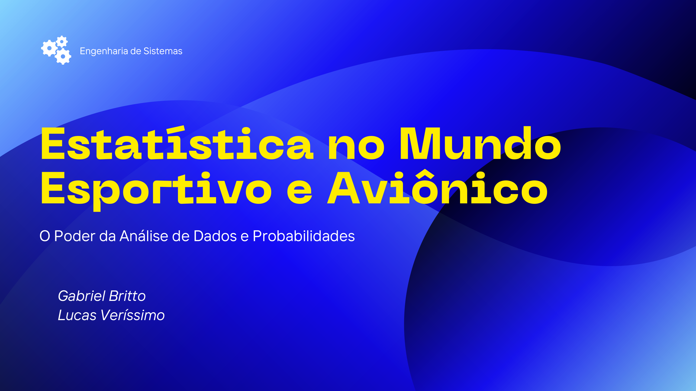
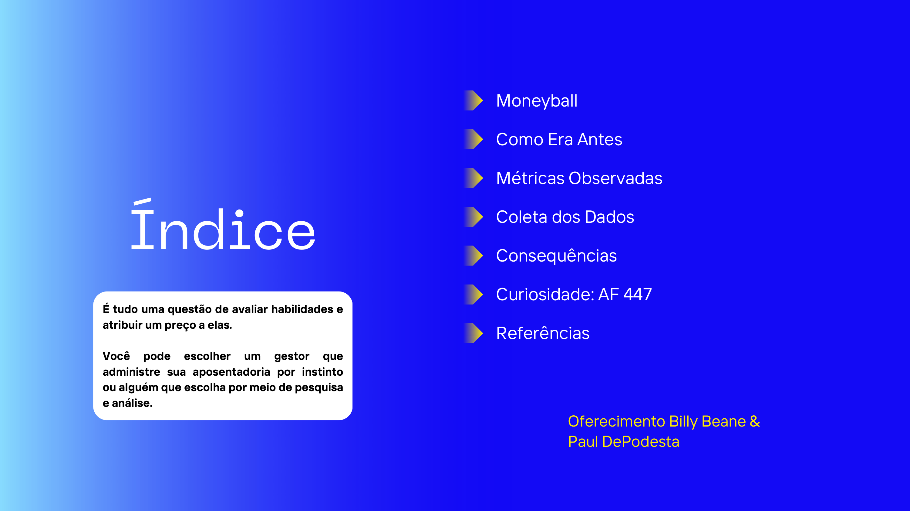
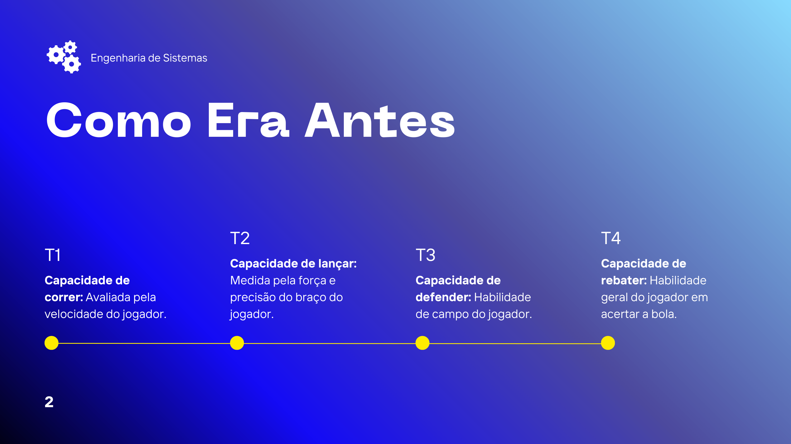
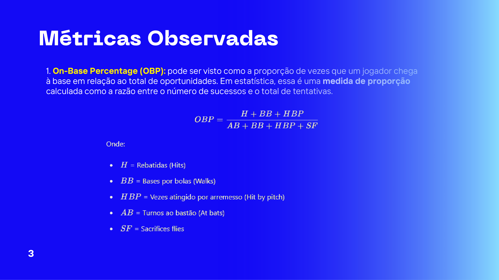
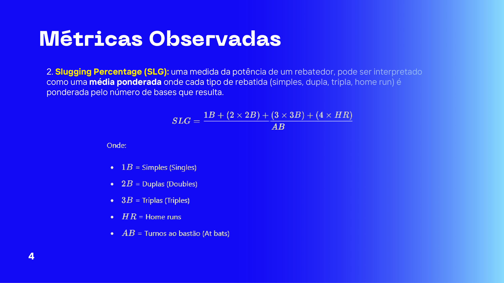
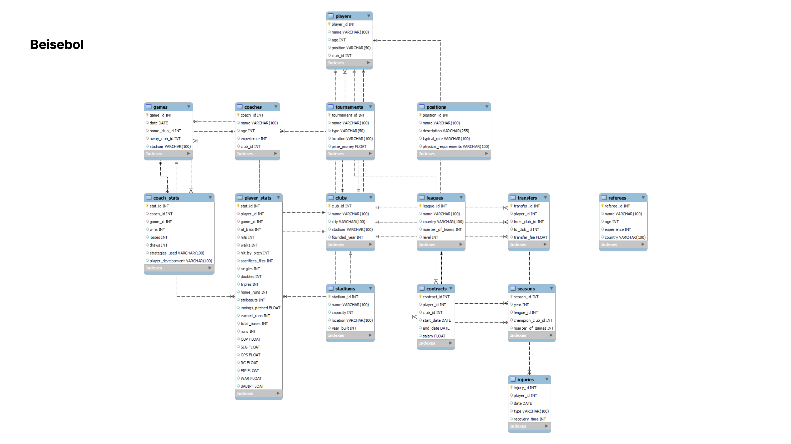
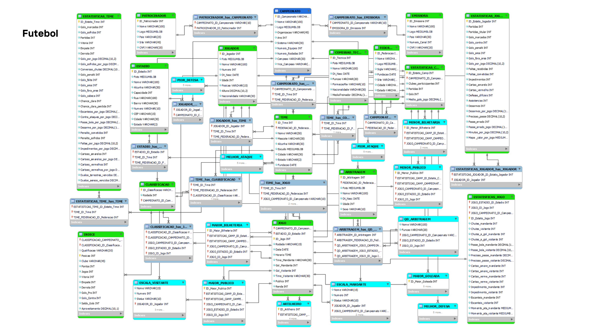
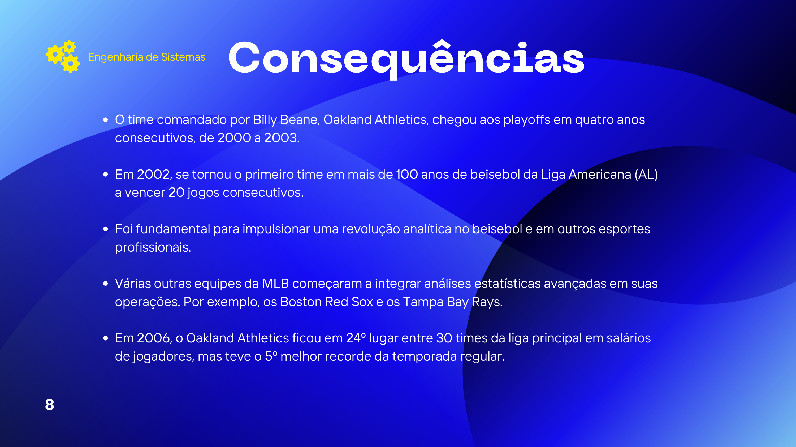
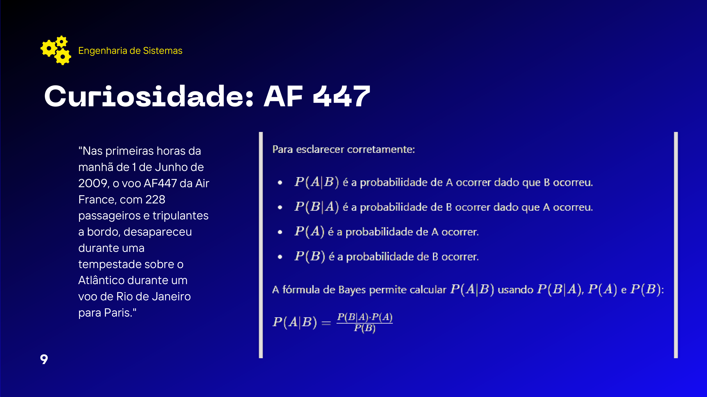
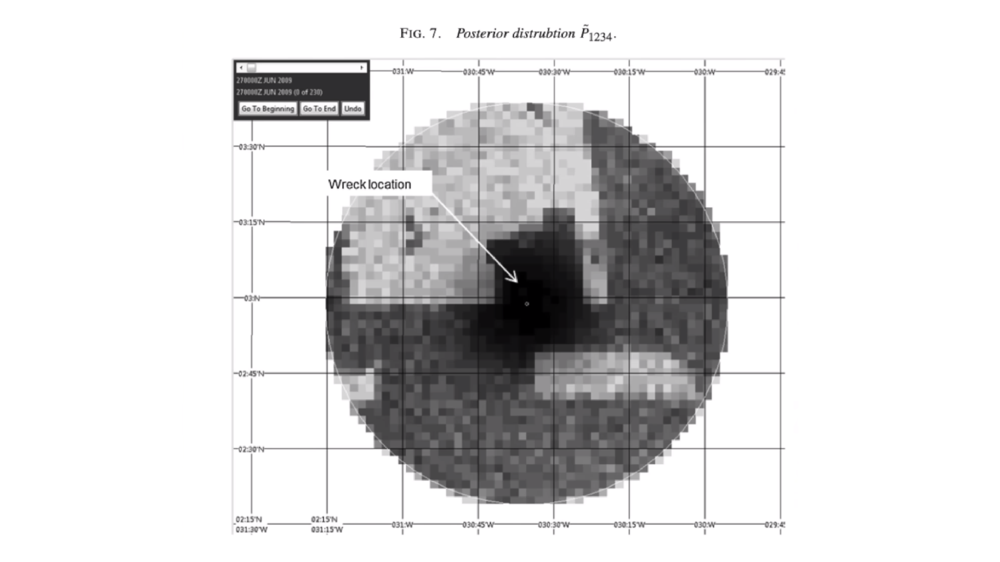

# Statistics in the Sports and Avionics World / Estatística no Mundo Esportivo e Aviônico

---

## English Version

### About the Project
This project presents an in-depth study on **"Statistics in the Sports and Avionics World: The Power of Data Analysis and Probabilities"** (*Estatística no Mundo Esportivo e Aviônico: O Poder da Análise de Dados e Probabilidades*), authored by **Gabriel Britto** and **Lucas Veríssimo** for Systems Engineering (*Engenharia de Sistemas*).

The presentation explores how data collection, advanced metrics, relational databases, and statistical methodologies transform decision-making across high-stakes industries:

1. **Sports Analytics & Sabermetrics (Moneyball):**
   - **Historical Context:** How player evaluations evolved from qualitative, subjective criteria (running speed, throwing strength, fielding ability, general hitting) to rigorous quantitative metrics.
   - **Key Metrics:**
     - *On-Base Percentage (OBP):* A proportion metric calculating success rate over total opportunities.
     - *Slugging Percentage (SLG):* A weighted average measuring hitting power based on total bases achieved.
   - **Data Collection:** Relational database schemas supporting structured advanced analytical queries.
   - **Real-world Impact:** Oakland Athletics under Billy Beane & Paul DePodesta, reaching 4 consecutive playoffs (2000–2003), setting a 20-game win streak in 2002, and outperforming teams with far higher player payrolls (e.g., 24th payroll with 5th best record in 2006), triggering a broader analytics revolution in MLB (Boston Red Sox, Tampa Bay Rays) and football/soccer.

2. **Aviation & Probabilistic Investigation (Air France 447):**
   - **Bayesian Investigation:** Application of Bayesian probability search theory in locating the wreckage of Flight AF 447 in the Atlantic Ocean after its disappearance in June 2009.

---

### How to View the Project

#### Option 1: PDF Viewer
Open `estatistica_mundo_esportivo.pdf` using any standard PDF viewer or web browser:
```bash
# On Linux / macOS / Windows
open estatistica_mundo_esportivo.pdf   # macOS
xdg-open estatistica_mundo_esportivo.pdf # Linux
```

#### Option 2: Document Screenshots
All 13 slide pages rendered as high-resolution images are embedded below.

---

### Presentation Screenshots

#### Slide 1: Cover Page


#### Slide 2: Table of Contents / Index


#### Slide 3: Moneyball


#### Slide 4: How It Was Before


#### Slide 5: Observed Metrics - On-Base Percentage (OBP)


#### Slide 6: Observed Metrics - Slugging Percentage (SLG)


#### Slide 7: Data Collection


#### Slide 8: Baseball


#### Slide 9: Football / Soccer


#### Slide 10: Consequences & Impact


#### Slide 11: Curiosity - Air France 447


#### Slide 12: Visual Slide


#### Slide 13: References


---

## Versão em Português

### Sobre o Projeto
Este projeto apresenta um estudo detalhado sobre **"Estatística no Mundo Esportivo e Aviônico: O Poder da Análise de Dados e Probabilidades"**, desenvolvido por **Gabriel Britto** e **Lucas Veríssimo** no âmbito do curso de Engenharia de Sistemas.

A apresentação explora como a coleta de dados, métricas avançadas, bancos de dados relacionais e metodologias estatísticas transformaram a tomada de decisões em áreas de alto impacto:

1. **Análise Esportiva e Sabermetria (Moneyball):**
   - **Contexto Histórico:** Como as avaliações de jogadores evoluíram de critérios subjetivos/instintivos (velocidade de corrida, força do braço, defesa, rebatida) para análises estatísticas quantitativas.
   - **Métricas Observadas:**
     - *On-Base Percentage (OBP):* Razão entre o número de chegadas à base e o total de oportunidades (medida de proporção/sucesso).
     - *Slugging Percentage (SLG):* Média ponderada que mede a potência do rebatedor conforme as bases conquistadas.
   - **Coleta de Dados:** Uso de esquema de banco de dados relacional com tabelas bem definidas para suportar análises avançadas.
   - **Consequências e Impacto:** A trajetória do Oakland Athletics sob o comando de Billy Beane e Paul DePodesta — 4 idas consecutivas aos playoffs (2000–2003), marca história de 20 vitórias consecutivas em 2002 e o 5º melhor desempenho na temporada regular de 2006 com a 24ª folha salarial da liga. O modelo impulsionou a revolução analítica no beisebol (Boston Red Sox, Tampa Bay Rays) e em outros esportes como o futebol.

2. **Aviação e Investigação Probabilística (Air France 447):**
   - **Investigação Bayesiana:** Aplicação da teoria de investigação bayesiana para a localização das destroços do voo AF 447 no Oceano Atlântico após o desaparecimento em junho de 2009.

---

### Como Abrir o Projeto

#### Opção 1: Visualizador de PDF
Abra o arquivo `estatistica_mundo_esportivo.pdf` em qualquer leitor de PDF ou navegador:
```bash
# Exemplo no Linux / macOS
xdg-open estatistica_mundo_esportivo.pdf
```

#### Opção 2: Imagens na Documentação
Todas as 11+ páginas (13 slides no total) da apresentação foram renderizadas e estão disponíveis em formato PNG logo abaixo.

---

### Demonstração dos Slides (Screenshots)

#### Slide 1: Capa


#### Slide 2: Índice


#### Slide 3: Moneyball


#### Slide 4: Como Era Antes


#### Slide 5: Métricas Observadas - OBP


#### Slide 6: Métricas Observadas - SLG


#### Slide 7: Coleta dos Dados


#### Slide 8: Beisebol


#### Slide 9: Futebol


#### Slide 10: Consequências


#### Slide 11: Curiosidade - AF 447


#### Slide 12: Visual


#### Slide 13: Referências

